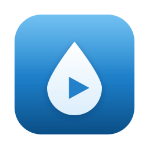

# Drupal CMS Launcher

**A macOS app that runs a local [Drupal CMS](https://new.drupal.org/drupal-cms) site.**

Everything it needs is inside the app: PHP, the database, Drupal CMS and its
dependencies. There is nothing to configure and nothing to download on first
launch.

Open the app and your browser shows Drupal CMS's own installer. You choose the
site name, a template and your administrator account; the app handles the
runtime underneath. Quit it and the site stops. Open it again and your content
is still there.

> [!NOTE]
> This project is not affiliated with or endorsed by the Drupal Association.
> Drupal maintains its own desktop launcher at
> [drupal/cms-launcher](https://github.com/drupal/cms-launcher).

## Requirements

Apple Silicon Mac running macOS 26 or later.

## Install

Download the disk image from the
[releases page](https://github.com/Omedia/cms-experimental-launcher/releases),
drag **Drupal CMS Launcher** into Applications, and open it.

Every push to `main` publishes a `latest` prerelease built from that commit.
Tagged versions get their own release.

## Use

The window shows the site's status and four actions:

| Action | Shortcut | What it does |
| --- | --- | --- |
| Open Drupal | <kbd>⌘O</kbd> | Opens the site in your default browser |
| Start Site / Stop Site | | Starts or stops the local server |
| Site Folder | | Reveals the site's files in Finder |
| View Logs | <kbd>⌘L</kbd> | Opens the log folder |

Quitting the app (<kbd>⌘Q</kbd>) stops the site. Closing the browser tab does
not.

Your site lives in `~/Library/Application Support/Drupal CMS Launcher/`. Stop
the app before copying that folder for a backup. Updating the app never replaces an
existing site's code or database.

## Scope

This is a local development and evaluation tool.

- One site at a time.
- The database is SQLite, like Drupal's own launcher. Moving a site to typical
  MySQL hosting needs a conversion step.
- Installing further Drupal packages and updating in place are not supported
  yet; the bundled dependency set is fixed at build time.
- Some optional features (template demo links, external services, extra
  translations) reach the internet when you use them.

## Documentation

- [Architecture](docs/architecture.md) — how the app, PHP and the site image fit
  together
- [Performance](docs/performance.md) — measured startup and install times, and
  what was tried
- [Contributing](CONTRIBUTING.md) — building from source, tests, project layout
- [Third-party software](THIRD_PARTY.md) — what is bundled, and under which
  licence

## Licence

GPL-2.0-or-later, the same licence as Drupal. See [LICENSE](LICENSE).

Drupal is a registered trademark of Dries Buytaert. The droplet in this app's
icon is original artwork, not Drupal's logo.
